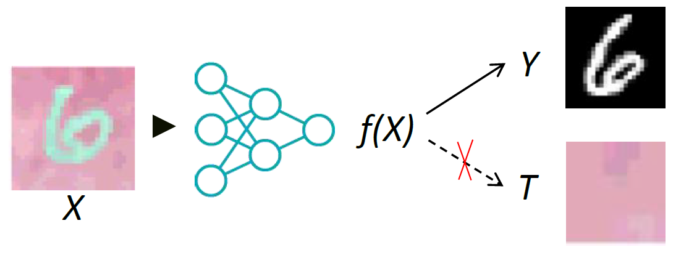
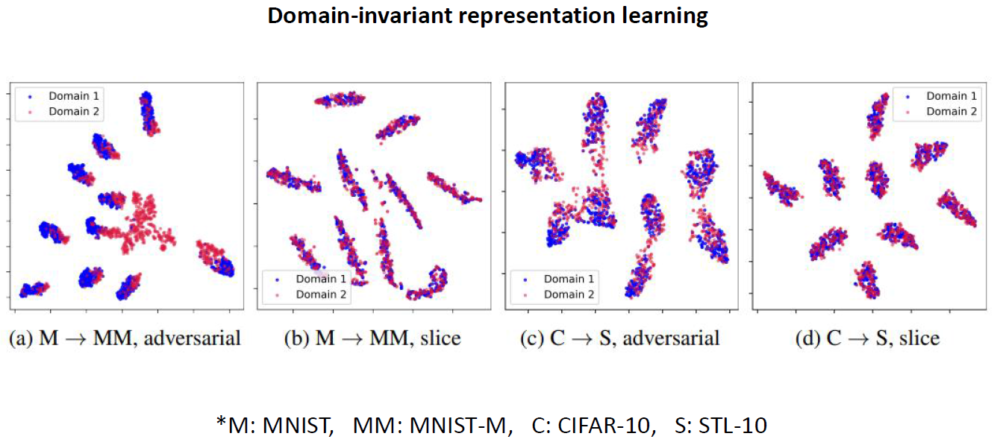
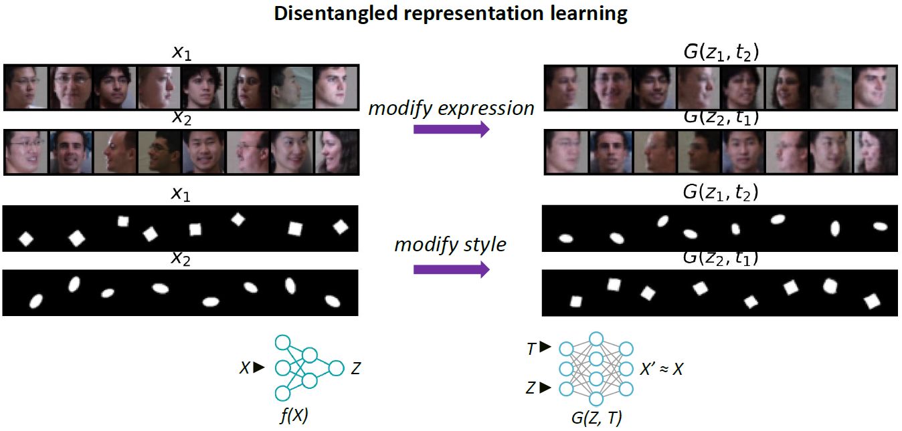

# Infomin Representation Learning

<p align="center"></p>

--------------------------------------------------------------------------------
This repository provides a PyTorch implementation of the paper ["Scalable Infomin Learning"](https://openreview.net/pdf?id=Ojakr9ofova), NeurIPS 2022.


## Introduction
We consider learning representation with the following objective:
$$\min L(f(X), Y) - \beta \cdot I(f(X); T)$$
where $L$ is some loss (e.g. BCE) and $I$ is the mutual information. This objective is ubiquitous in fairness, invariance, disentangled representation learning, domain adaptation, etc. In the figure above, $Y$ is the digit and $T$ is the color.  

To optimise this objective, traditionally we need to (re-)estimate $I$ before every update to $f$. However estimating $I$ is challenging. We show to minimise $I$ we indeed need not to estimate it: just consider random `slices' of it is enough.


## Materials

* [Slides](materials/slides.pdf)
* [Poster](materials/poster.png)
* [Demo](demo_mi_minimization.ipynb)


## Prerequisite


### 1. Libraries

* Python 3.5+
* Pytorch 1.12.1
* Torchvision 0.13.1
* Numpy, scipy, matplotlib

We strongly recommend to use conda to manage/update library dependence:
```
conda install pytorch torchvision matplotlib
```


### 2. Data
Please run the following script to download the PIE dataset (contributed by [https://github.com/bluer555/CR-GAN](https://github.com/bluer555/CR-GAN))
```
bash scripts/download_pie.sh
```


## MI estimators/proxies

at /mi

* Pearson Correlation
* Distance Correlation
* Neural Total Correlation
* Neural Renyi Correlation
* CLUB
* Sliced independence testing (*ours)


## Applications

at /tasks

* Fairness
* Disentangled representation learning
* Domain adaptation

## Results


<p align="center"></p>


<p align="center"></p>


